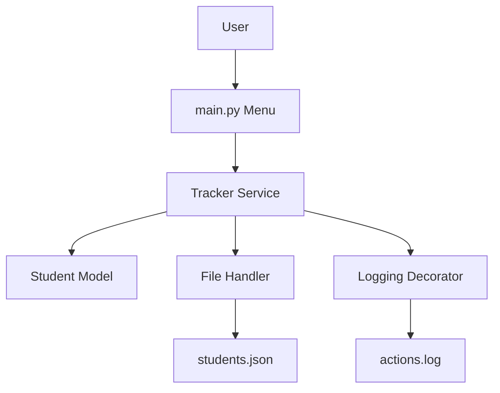
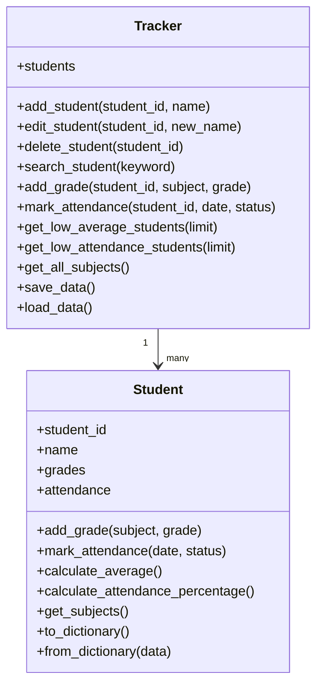
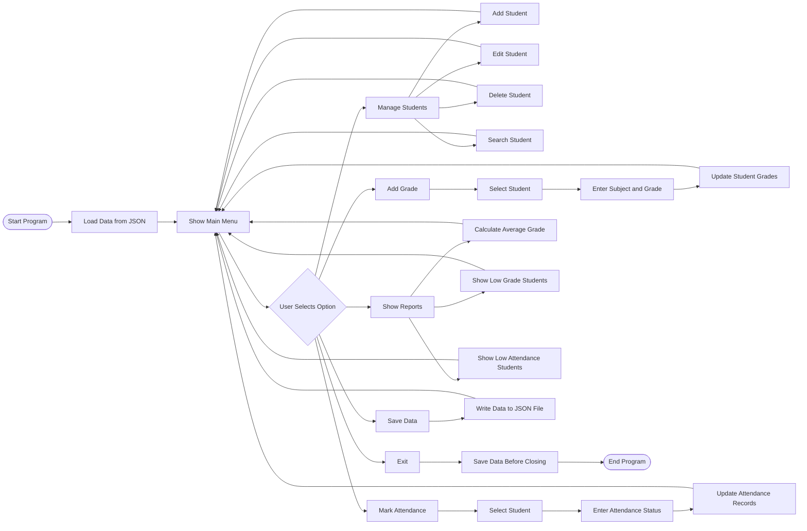

# Diagrams for Presentation

## 1. Architecture Diagram

The architecture diagram shows the main structure of the project.  
The user interacts with the menu in `main.py`. The menu calls the `Tracker` service, which manages students, grades, attendance, file handling, and logging.

---

## 2. UML Class Diagram

The UML class diagram shows the two main classes of the project.  
The `Student` class stores information about one student, while the `Tracker` class manages all students and the main project operations.

---

## 3. Program Flowchart

The flowchart shows the main execution process of the program.  
The application starts by loading saved data from a JSON file. Then, the main menu is displayed, and the user selects an action. After completing each action, the program returns to the main menu. When the user chooses to exit, the data is saved before the program closes.