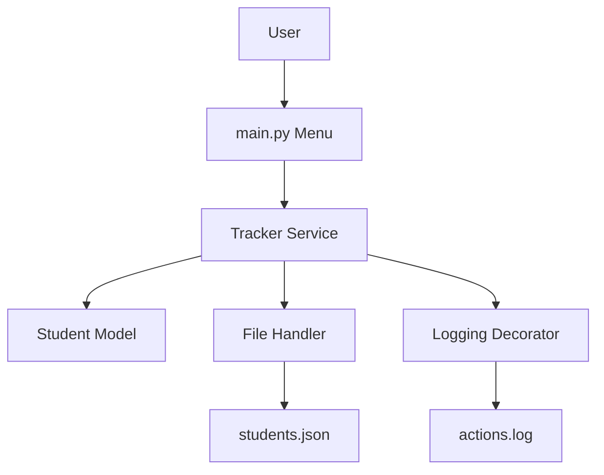
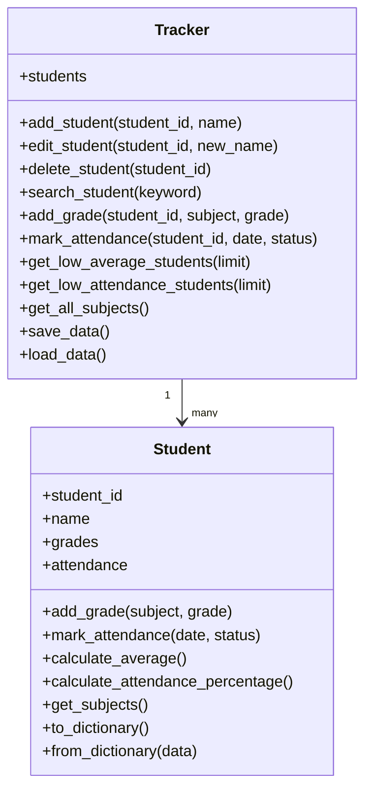
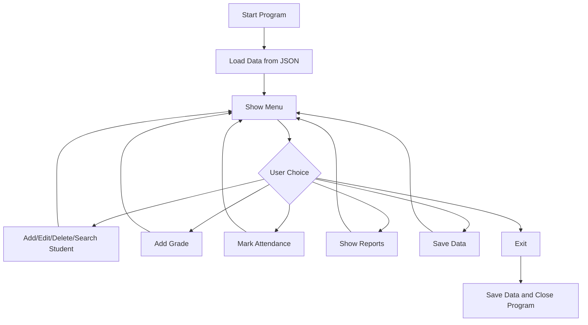

# Diagrams for Presentation

## 1. Architecture Diagram

```mermaid
flowchart TD
    A[User] --> B[main.py Menu]
    B --> C[Tracker Service]
    C --> D[Student Model]
    C --> E[File Handler]
    C --> F[Logging Decorator]
    E --> G[students.json]
    F --> H[actions.log]
```

## 2. UML Class Diagram

```mermaid
classDiagram
    class Student {
        +student_id
        +name
        +grades
        +attendance
        +add_grade(subject, grade)
        +mark_attendance(date, status)
        +calculate_average()
        +calculate_attendance_percentage()
        +get_subjects()
        +to_dictionary()
        +from_dictionary(data)
    }

    class Tracker {
        +students
        +add_student(student_id, name)
        +edit_student(student_id, new_name)
        +delete_student(student_id)
        +search_student(keyword)
        +add_grade(student_id, subject, grade)
        +mark_attendance(student_id, date, status)
        +get_low_average_students(limit)
        +get_low_attendance_students(limit)
        +get_all_subjects()
        +save_data()
        +load_data()
    }

    Tracker "1" --> "many" Student
```

## 3. Program Flowchart

```mermaid
flowchart TD
    A[Start Program] --> B[Load Data from JSON]
    B --> C[Show Menu]
    C --> D{User Choice}
    D --> E[Add/Edit/Delete/Search Student]
    D --> F[Add Grade]
    D --> G[Mark Attendance]
    D --> H[Show Reports]
    D --> I[Save Data]
    D --> J[Exit]
    E --> C
    F --> C
    G --> C
    H --> C
    I --> C
    J --> K[Save Data and Close Program]
```
