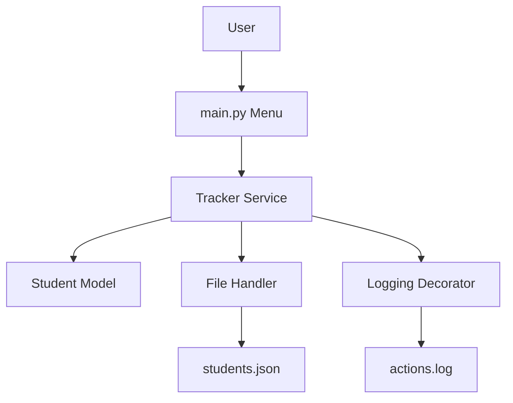
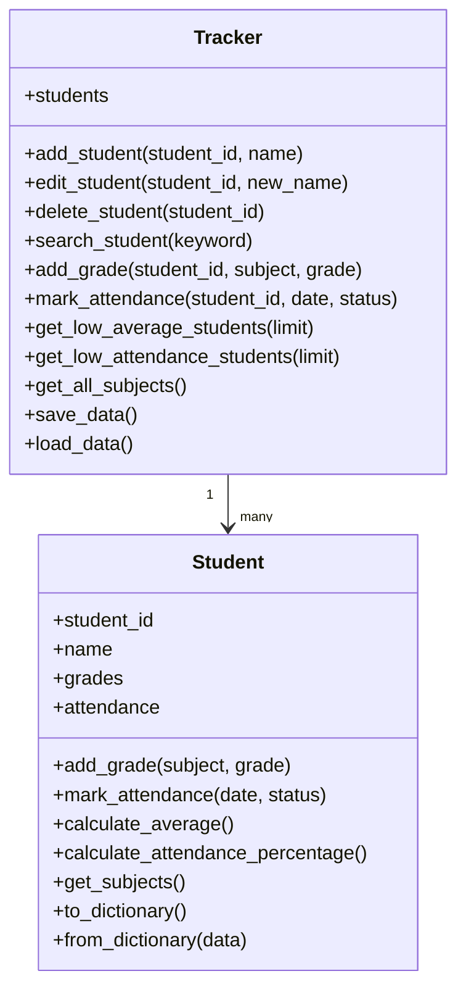

# Diagrams for Presentation

## 1. Architecture Diagram

## 2. UML Class Diagram

## 3. Program Flowchart

flowchart LR
    A([Start Program]) --> B[Load Data from JSON]
    B --> C[Show Main Menu]
    C --> D{User Selects Option}

    D --> E[Manage Students]
    E --> E1[Add / Edit / Delete / Search Student]
    E1 --> C

    D --> F[Add Grade]
    F --> F1[Update Student Grades]
    F1 --> C

    D --> G[Mark Attendance]
    G --> G1[Update Attendance Records]
    G1 --> C

    D --> H[Show Reports]
    H --> H1[Average Grade / Low Attendance / Low Grade]
    H1 --> C

    D --> I[Save Data]
    I --> I1[Write Data to JSON File]
    I1 --> C

    D --> J[Exit]
    J --> K[Save Data Before Closing]
    K --> L([End Program])